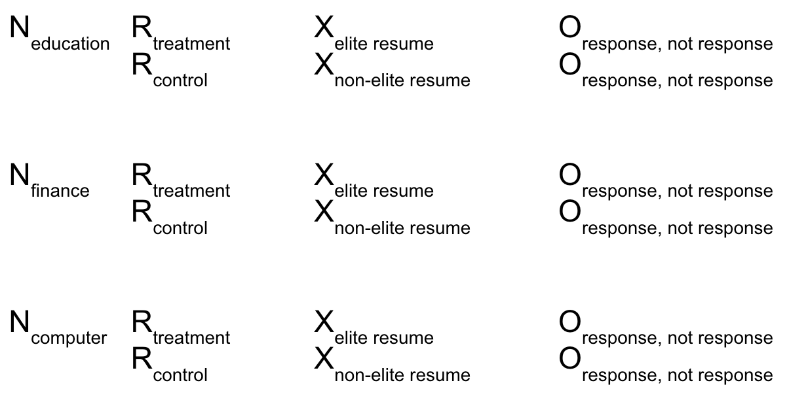

```{r setup, include=FALSE}
knitr::opts_chunk$set(echo = TRUE)

# Load packages
library(car)
library(data.table)
library(ggplot2)
library(knitr)
# install.packages("kableExtra")
library(kableExtra)
library(lmtest)
library(sandwich)
library(stargazer)
library(stringr)
library(pwr)

# Configure Options
options("digits" = 2)   # Only print 2 decimal places
rm(list=ls())
```

Marcelo Blinder, Ivan Fan, Sarah Danzi, Hersh Solanki

## Introduction

The prestige and name recognition bestowed upon the nation’s Ivy League and elite institutions is pervasive in American culture. And, arguably, it is a deserved reputation: every current Supreme Court Justice attended an Ivy League law school;^1^ 16 of the 44 U.S. presidents received bachelor's degrees from Ivy League institutions. This study seeks to explore that cachet by examining the weight it carries for a candidate applying to entry-level jobs online. It will measure if employers are more interested in hiring candidates with a bachelor’s degree from an elite school to answer the conceptual question, “Does an elite undergraduate education open more doors?”

## Background

With the cost to attend elite, private universities climbing upward to $53,611^2^ a year, there is debate around whether or not significantly different benefits are realized by graduates of elite institutions versus their non-elite counterparts. 

Other researchers have studied this question. In 2013, Kenway et al. of Monash University^3^ wrote about the benefits of elite education, describing them as “banks of emotion” whereby multiple generations of elite families make emotional investments that pay social dividends. Elites attend such schools, affording the schools and the elites who attend them enduring social stature and ascendency. An older study published back in 1998 by Eide et al^4^ investigates the question ‘Does it pay to attend an elite private college?” They find that attendance at an elite private college significantly increases the probability of graduate school attendance, another proxy for success. 

We seek to test the belief that attending an elite school will bring benefits for the graduates of those schools. Our null hypothesis is that there is no difference between attending an elite school versus a non-elite school in garnering first round interview invitations from online job search engines; our alternative hypothesis is that there is a difference between attending an elite school versus a non-elite school in garnering positive responses from online job search engines, where garnering a response is a proxy for labor market success. 

## Experimental Design

We designed an audit study to explore the aforementioned hypothesis. To begin, we identified 180 full-time, entry-level job postings in the US across three different job sectors (Computer Science, Finance, Public Service) on the online job search engine, glassdoor.com. The respective job titles selected for each sector were Software Developer, Financial Analyst, and Elementary School Teacher.  The employers advertising these job postings on glassdoor.com represent the subjects of our experiment and our sample population.

The three job types were explicitly chosen in order to support a blocked experimental design and enable us to analyze our results based on a covariate we believe may strongly influence treatment outcomes.  Financial analyst was selected due to reports that show a significant proportion of Ivy League graduates take jobs in finance or consulting upon graduation.^5^  Elementary school teacher was selected because it is not a profession commonly pursued by top tier students.^6,7^  Software developer was selected as a position for the experiment because it is ranked as the most in-demand job for 2019.^8^  By selecting a job position that plays to elite schools’ strengths, one that does not, and one that is universally in-demand, we will be able to determine if an affinity for hiring elite students transcends job position or if the position is a variable itself and correlated with outcome.  Complete random assignment occurred within each of the blocks with 50% of the employers being placed in the treatment group and 50% being placed in the control group.

In order to signal each fictitious candidate’s undergraduate institution while achieving ceteris paribus in all other aspects of the applicant’s qualifications, a single fictitious resume was created for each job sector and was modified according to whether the posting employer was assigned to control or treatment. If the employer was assigned to the control group, the resume was updated to show the job candidate as a graduate of a public, state college/university. If the employer was assigned to the treatment group, the resume was updated to show the job candidate as a graduate of an elite college/university. All other features of the resumes besides the school name were held constant. We were careful to make sure that the education was not *outweighed* by the work experience. Our assumption was that working as a software engineer for a high profile company like Google could render where a candidate went to school irrelevant, confounding our experimental results.

To increase the generalizability of the experiment's results, the experimental design included a *variation in treatment* approach.  Rather than study the treatment effect of graduating from any one elite university, ten schools were selected to represent the population of elite institutions in the US and ten schools were selected to represent the population of non-elite, state schools in the US.  The subset of elite US schools chosen for the experiment were Stanford, MIT, Harvard, Princeton, Yale, UPenn, Cornell, Dartmouth, Columbia, and Brown.  The subset of non-elite US state schools chosen for the experiment were University of California, University of Massachusetts - Amherst, University of Massachusetts - Boston,  Rutgers, University of CT, Penn State, City University of New York (CUNY) - Brooklyn College, University of New Hampshire, University at Buffalo - State University of New York (SUNY), and University of Rhode Island.  Each school was used an identical number of times within each block and randomly assigned to a job post. In all cases, well-respected state schools were selected based on current rankings.^9^   In addition, state schools were selected such that their locations were geographically similar to the elite schools (e.g., Rutgers in New Jersey is selected as a control school for Princeton).

The research design can be summarized using Trochim and Donnelly's ROXO design:

```{r pressure, echo=FALSE, fig.align='center', fig.cap="ROXO Analysis", out.width = '60%', fig.pos="H"}

```


The outcome, or effect of the treatment, will be measured by comparing the number of positive employer responses received within the treatment and control groups.  A positive response is considered any communication from the employer that expresses interest in further exploring our candidate's application:  this may include, but is not limited to, a request for an interview or an email asking us for additional information or references.  Responses will be recorded for a period of four weeks following the application date and all job applications will be submitted on the same day to avoid any potential temporal bias.

The experimental design will be further augmented by documenting and analyzing three additional characteristics of each job application:  the employer rating on Glassdoor, the job posting's advertised salary, and the distance between the job location and the applicant’s university. These are included as covariates because we believe these features could possibly offer additional corollary insights into response rates. They will also enable us to perform a covariate balance check, ensuring our randomization of applicant to employer was successful.

By conducting this design within glassdoor.com, we avoided the need for research confederates and eliminated unnecessary variation in the way in which treatments were delivered. Employers received resumes that were identical apart from the candidate’s undergraduate institution. 


### Randomization

The following algorithm was used for treatment assignment:

1. A list of the 60 employers who advertised our selected job postings was created for each block.
2. An array of 60 elements was created where 30 elements were set to 0 (control) and 30 were set to 1 (treatment)
3. The array of 60 elements was shuffled randomly. The resulting array contains 30 ones and 30 zeros in a random order.
4. The companies were assigned using the array from step (3). The first company was assigned to the first element of the array, the second company was assigned to the second element of the array and so on.

### Pilot Study

To validate and inform our experimental design, we conducted a pilot study.  Scaling the experimental design down, we applied to 12 positions, four in each block with an even division of assignment to treatment and control within the blocks.  We allowed the pilot to run for ten days.  At its conclusion, only one positive response was received;  no negative responses were received. Given the low response rate of the pilot study, we increased the sample size for the experiment by fifty percent, from 120 to 180 subjects. 


## Experiment Results

The table below shows an extract of the raw data collected during the experiment. Each row represents one of the 180 job applications.

```{r, echo=FALSE, warning=FALSE, fig.pos="H"}

# Import the CSV file into a data table
raw_data <- fread("./data/raw/data.csv", header = T)

# Pretty print the data collected
kable(raw_data[, head(.SD, 8)], format="latex") %>%
  kable_styling(bootstrap_options = c("striped", "hover"), latex_options="scale_down")
```

For each of the job applications, eleven data points were collected:

* `Block` - per the experimental design, the block associated with the subject 
* `School` - (treatment) - undergraduate school represented on the resume
* `School Location` - geographic location of the undergraduate school (e.g., city, state) 
* `Position` - employer name
* `Location` - geographic location of the employer's job position (e.g., city, state) 
* `Rating` - employer rating on glassdoor.com
* `Salary Low` - minimum salary of the advertised position, as advertised on glassdoor.com
* `Salary High` - maximum salary of the advertised position, as advertised on glassdoor.com
* `Date Applied` - the calendar date on which the we submitted a resume to the job position 
* `Date Responded` - the calendar date on which we received a response, if any
* `Interested` - (outcome) - a yes/no indicator of whether the response we received was one that expressed interest in pursuing our candidacy 

This raw data was codified for analysis.  The *School* variable was used to categorize each job application as belonging to the treatment or control group, depending on whether the school was identified as elite by the experimental design.  The *Interested* variable was used to assign a binary classification to treatment effect (e.g., whether or not a positive employer response was received for a job application).  A lack of response, as well as a negative response from the employer, were both codified as a zero for treatment effect.  As a descriptive characteristic of outcome, we also recorded the date on which employer responses were received to be able to look for differences in response timelines based on treatment assignment.


```{r, echo=FALSE, warning=FALSE, fig.pos="H"}
# Import data that includes distance analysis done in Python (see submited Python code)
dt <- fread("./data/analysis/Data With Distance.csv", header = T)

# Remove spaces from column names
names(dt) <- make.names(names(dt), unique=TRUE)

# Fill in blanks with 'No Response'
dt$Interested <- sub("^$", "No Response", dt$Interested)

# Create a column that generalizes responses such that "No" and "No Response" both equate to 0.
dt$Positive.Response <- car::recode(dt$Interested, "c('No', 'No Response') = 0; 'Yes' = 1")

# Create a column that calculates the salary midpoint where a low and high salary value were supplied.
# Where salary was supplied in an hourly rate, set the value to NA since we do not want to estimate 
# how many hours may be worked in a calendar year to estimate annual wages.
dt$Salary.Midpoint <- (dt$Salary.Low + dt$Salary.High) / 2
dt[Salary.Midpoint < 50, Salary.Midpoint :=  NA]


# Recode the school to identify whether or not the school is elite
dt$School.Type <- car::recode(dt$School, "c('Brown', 'Columbia', 'Dartmouth', 'Harvard', 'MIT', 'Cornell', 'Princeton',
                   'Yale', 'Stanford', 'UPenn') = 'Elite'; c('CUNY', 'Penn State', 'Rutgers', 'SUNY', 'UCLA',
                   'UConn', 'UCOnn', 'UMassAmherst', 'UMassBoston', 'UNH', 'URI') = 'State'")

dt$Treatment <- car::recode(dt$School, "c('Brown', 'Columbia', 'Dartmouth', 'Harvard', 'MIT', 'Cornell', 'Princeton',
                   'Yale', 'Stanford', 'UPenn') = 1; c('CUNY', 'Penn State', 'Rutgers', 'SUNY', 'UCLA',
                   'UConn', 'UCOnn', 'UMassAmherst', 'UMassBoston', 'UNH', 'URI') = 0")

# Calculate the delta between date of application and ate of response
dt$Days.Til.Positive.Response <- as.numeric(as.Date(as.character(dt$Date.Responded), format="%m/%d/%Y") - 
  as.Date(as.character(dt$Date.Applied), format="%m/%d/%Y"))
```


#### Outcome By Treatment and Block

The table below summarizes the outcome results for each category of school.  With 90 applications submitted to both elite and state schools, we received 11 positive responses for elite schools and 13 for state schools. 

```{r, echo=FALSE, fig.pos="H"}
# Compare elite schools to state schools for mean number of responses
d_agg_responses <- as.data.table(dt[, .(.N, mean(Positive.Response, na.rm = TRUE)), by = School.Type])

d_agg_responsetimes <- as.data.table(dt[Interested == 'Yes', 
                                        .(.N, mean(Days.Til.Positive.Response, na.rm = TRUE))
                                        , by = School.Type])

# Join the two aggregated data tables 
d_agg = d_agg_responses[d_agg_responsetimes, on = c(School.Type = 'School.Type')]
setcolorder(d_agg, c("School.Type", "N", "i.N", "V2", "i.V2"))

# Pretty print the data collected
kable(d_agg, format="latex", col.names = c("School Type","Number of Job Applications", "Number of Positive Responses", 
                                           "Mean Positive Responses Received", "Mean Positive Response Time (Days)")) %>%
  kable_styling(bootstrap_options = c("striped", "hover"),latex_options="scale_down")

```

The bar graph depicts the distribution of these results, color-coded by profession. Note that the outcome, 'No Response', is fairly consistent among the three professions and that the Teacher block did not have a single response that was "No".

```{r, echo=FALSE, fig.pos="H"}

# Plot the frequency of response categories 
rr <- ggplot(dt, aes(x=Interested)) + geom_bar(aes(fill = Block), position = "dodge") + 
  scale_fill_manual(values = c("#003262", "#D9661F", "#3B7EA1")) 

print(rr + labs(title= "Response Rate By Profession", 
                      y="Frequency", x = "Employer Response") + 
        theme(plot.title = element_text(hjust = 0.5), 
              legend.text=element_text(size=8), 
              legend.title=element_text(size=9)) )

```


The table below summarizes experimental outcomes by block.  

```{r, echo=FALSE, fig.pos="H"}
# Compare elite schools to state schools for mean number of responses by profession
d_agg_blocked_responses <- as.data.table(dt[, .(.N, mean(Positive.Response, na.rm = TRUE)) ,by = list(School.Type, Block)])

# Compare elite schools to state schools for mean number of responses by profession
d_agg_blocked_responsetimes <- as.data.table(dt[Interested == 'Yes', 
                                                .(.N, mean(Days.Til.Positive.Response, na.rm = TRUE)), 
                                                by = list(School.Type, Block)])

# Join the two aggregated data tables 
d_blocked = d_agg_blocked_responses[d_agg_blocked_responsetimes, on = c(School.Type = 'School.Type', Block = 'Block')]
setcolorder(d_blocked, c("School.Type", "Block", "N", "i.N", "V2", "i.V2"))

# Pretty print the data collected
kable(d_blocked, format="latex",  
      col.names = c("School Type", "Profession", "Number of Job Applications", "Number of Positive Responses",  
                    "Mean Positive Responses Received","Mean Positive Response Time (Days)")) %>%
  kable_styling(bootstrap_options = c("striped", "hover"), latex_options="scale_down") 

```

Two out of three blocks (Teacher, Finance) report a higher positive response rate for elite schools (measured in the hundredths).  However, of note is the Computer Science block.  While it was the only block to show a higher positive response rate for state schools, the difference recorded between treatment and control was far more significant than in the other blocks, measurable in the tenths digit.  

<!-- For the positive responses received from employers, the table below depicts, by block, the number of days that passed between the experiment's submission of a resume and the employers' responses.  The histogram is color-coded to highlight which responses are associated with each class of school.  Note how most responses are aggregated within the first 10 days of applying. -->


```{r, echo=FALSE, warning=FALSE, fig.pos="H"}

# # Plot the response timeline observed for each block
# p<-ggplot(data = dt[!is.na(Days.Til.Positive.Response) & Interested == 'Yes', ], 
#           aes(x=Days.Til.Positive.Response, fill=School.Type), position = "dodge") + 
#   geom_histogram(binwidth=.5, color='black') + scale_x_continuous(limits=c(0,31)) +
#   scale_fill_manual(values = c("#003262", "#D9661F")) +
#   facet_grid(Block ~ .)
# 
# 
# print(p + labs(title= "Timeline of Positive Responses By Block", 
#                       y="Frequency", x = "Number of Days Between Resume Submission and Employer Response") + 
#         theme(plot.title = element_text(hjust = 0.5), 
#               legend.text=element_text(size=8), 
#               legend.title=element_text(size=9)) )

```


<!-- The graph highlights an interesting observation.  With the exception of a single job application in the Computer Science block, only elite schools continue to generate responses past week one, ultimately driving the average mean positive response time of elite schools up. -->


### Covariate Examination

The table below summarizes the covariate characteristics of the control and treatment groups.

```{r, echo=FALSE, fig.pos="H"}
# Create a table that shows the covariate balance between control and treatment.
d_cov_balance <- as.data.table(dt[, .(mean(Rating, na.rm = TRUE),
                                      mean(Distance, na.rm = TRUE),
                                      mean(Salary.Midpoint, na.rm = TRUE) 
                                      ), by = School.Type])

# Pretty print the table
kable(d_cov_balance, format="latex",
      col.names = c("School Type", "Mean Employer Rating", 
                    "Mean Distance Between Job Location and School", "Mean Salary")) %>%
  kable_styling(bootstrap_options = c("striped", "hover"), latex_options="scale_down")

```

```{r, echo=FALSE, fig.pos="H"}

# Regress treatment assignment against our covariates
m_randon_assignment = lm(Treatment ~ as.numeric(Rating) + as.numeric(Salary.Midpoint) + Distance, data = dt)

# Calculate robust standard errors
m_randon_assignment$vcovHC_ <- vcovHC(m_randon_assignment)
ci_m_randon_assignment = coefci(m_randon_assignment, vcov = m_randon_assignment$vcovHC_)
p.m_randon_assignment = coeftest(m_randon_assignment, vcov = m_randon_assignment$vcovHC_)[,4]

# Display results
# stargazer(
#  m_randon_assignment,  
#  type = 'text',
#  report = ('v*c*sp'),
#  p = list(p.m_randon_assignment),
#  se=list(sqrt(diag(m_randon_assignment$vcovHC_))), 
#  header=F
#  )

```

To test for covariate balance, treatment assignment is regressed on the covariates to test the null hypothesis that the covariates do not predict assignment into the treatment or control group.  The p-values for each of the covariates are respectively, `r p.m_randon_assignment[2]` for employer rating, `r p.m_randon_assignment[4]` for distance, and `r p.m_randon_assignment[3]` for salary.  None fall below the p-value of 0.05, regarded as the standard for statistical significance. 

A detailed look at each of the covariates' definitions and distributions within each block follows.

###### Distribution of Employer Ratings

The employer rating on Glassdoor reflects the quality of the company as determined by its employees and may range from 0.0 to 5.0 stars.  It was selected as a covariate of interest because we believed that there may be a correlation between employer rating and response rate, assuming that companies with higher ratings offer more desirable workplaces and/or benefits, thus increasing the competition for their positions and affecting our chance of advancing to an interview after a resume submission.  For purposes of our analysis, we binned the ratings into intervals.  The figure below depicts the distribution of these ratings, color-coded by profession.  

```{r, echo=FALSE, fig.pos="H"}
# Set text entries of "NA" and "N/A" in the dataset to R's NA object
dt$Rating[dt$Rating=='NA'] <- NA
dt$Rating[dt$Rating=='N/A'] <- NA

# Define the breaks for binning employer ratings 
#breaks <- c(2,2.5,3,3.5,4,4.5,5)
breaks <- c(2,3,4,5)

# specify interval/bin labels
#tags <- c("[2-2.5)", "[2.5-3)","[3-3.5)", "[3.5-4)","[4-4.5)", "[4.5-5)")
tags <- c("[2-3)","[3-4)","[4-5)")

dt$Rating.Bin <- cut(as.numeric(dt$Rating), 
                     breaks=breaks, 
                     include.lowest=TRUE,
                     right=FALSE, 
                     labels=tags)
dt$Rating.Bin <- factor(dt$Rating.Bin, levels=c(levels(dt$Rating.Bin), 'MISSING'))
dt$Rating.Bin[is.na(dt$Rating.Bin)] <- 'MISSING'


# Plot the frequency of response categories 
rr <- ggplot(data = dt, aes(x=Rating.Bin), na.rm=FALSE) + 
  geom_bar(color='black', aes(fill = Block), position = "dodge") +
  scale_fill_manual(values = c("#003262", "#D9661F", "#3B7EA1", "#FDB515"))

print(rr + labs(title= "Distribution of Employer Ratings on Glassdoor", 
                      y="Frequency", x = "Rating in Stars") + 
        theme(plot.title = element_text(hjust = 0.5), 
              legend.text=element_text(size=8), 
              legend.title=element_text(size=9)) )

```

###### Distance

The distance measure reflects, in miles, the Euclidean distance between the school of the applicant (their presumed current place of residence) and the location of advertised job.  It was selected as a covariate of interest because we believed that employers may show a preference to candidates more proximal to their location.  We hypothesize this because we believe it could reduce employers' potential exposure to relocation costs and that hiring managers may be more likely to be from nearby schools themselves (e.g., graduates of a state school are more likely to be from that state and settle post-college in that state).  The histogram below plots the distribution of these distances, color-coded by whether the job application was in the treatment or control group.

```{r, echo=FALSE, fig.pos="H"}
# Plot the distribution of distances the school and job location of each row of data
rr <- ggplot(data = dt, aes(x=Distance, fill=School.Type), na.rm=FALSE) +
 geom_histogram(bins=50,  color='black', position = "dodge") +
 scale_fill_manual(values = c("#003262", "#D9661F", "#3B7EA1", "#FDB515"))

print(rr + labs(title= "Proximity of School to Job Location",
                     y="Frequency", x = "Distance (Miles) Between School and Job") +
       theme(plot.title = element_text(hjust = 0.5),
             legend.text=element_text(size=8),
             legend.title=element_text(size=9)) )

missing_distance_info = sum(is.na(dt$Distance))

```

We observe that the mean proximity for elite schools was `r dt[Treatment == 1, mean(Distance)]` and for non-elite schools was `r dt[Treatment == 0, mean(Distance)]`. The above visualization also displays how elite schools skew towards longer distances. The t-test strongly rejects the hypothesis that the mean proximities are the same (p-value = `r sprintf('%.5f', t.test(dt$Distance[dt$Treatment == 0], dt$Distance[dt$Treatment == 1])$p.value)`). Therefore, in this case, the treatment is correlated with the proximity covariate, and proximity should not be used for the analysis. Even though we were careful about trying to keep the distances independent of the treatment, it seems that we got unlucky in our attempt to randomize.

###### Salary

The salary measure reflects, in dollars, the midpoint value of the annual salary range advertised for the job position.  Data is not included for positions that offered hourly rates, most commonly seen in the teacher block, as we did not have a means by which to annualize the rate for an apples-to-apples comparison of salary data.  Salary was selected as a covariate of interest because we believed that employers offering more competitive compensation are likely to receive a greater number of applicants, thus increasing the competition for the job and affecting our likelihood of a response.  This histogram shows the distribution of salary for our job applications, with the greatest number of positions falling in the $60-100k range.  

```{r, echo=FALSE, fig.pos="H"}
# Based on this distribution, bin the salaries into 20k buckets
#breaks <- c(20000,40000,60000,80000,100000,120000)
breaks <- c(20000,60000,100000,200000)

# Specify bin labels, 0 to 8 that correspond to the following ranges:
#tags <- c("[20-40k)", "[40-60k)", "[60-80k)", "[80-100k)", "Over 100k")
tags <- c("[20-60k)", "[60-100k)", "Over 100k")

dt$Salary.Bin <- cut(as.numeric(dt$Salary.Midpoint), 
                     breaks=breaks, 
                     include.lowest=TRUE,
                     right=FALSE, 
                     labels=tags)
dt$Salary.Bin <- factor(dt$Salary.Bin, levels=c(levels(dt$Salary.Bin), 'MISSING'))
dt$Salary.Bin[is.na(dt$Salary.Bin)] <- 'MISSING'


rr <- ggplot(data = dt, aes(x=Salary.Bin, fill=School.Type), na.rm=FALSE) +
  geom_bar(color='black', position = "dodge") +
  scale_fill_manual(values = c("#003262", "#D9661F", "#3B7EA1", "#FDB515"))

print(rr + labs(title= "Salaries Associated with Job Applications", 
                      y="Frequency", x = "Annual Advertised Wage in Dollars") + 
        theme(plot.title = element_text(hjust = 0.5), 
              axis.text.x = element_text(angle = 90),
              legend.text=element_text(size=8), 
              legend.title=element_text(size=9)) )

missing_salary_info = sum(is.na(dt$Salary.Midpoint))
```

Note: `r missing_salary_info` of the positions did not supply salary information.


## Average Treatment Effect 

We first examine our results by using regression to measure the overall, unblocked average treatment effect of an applicant graduating from an elite university.

```{r, echo=FALSE, warning=FALSE, results='asis', fig.pos="H"}

# Perform a regression that compares the response to school type
# Regardless of how long it took an employer to respond, this model estimates the effect 
# of having graduated from an elite school
m_elite_binary = lm(Positive.Response ~ Treatment, data = dt)

# Calculate robust standard errors
m_elite_binary$vcovHC_ <- vcovHC(m_elite_binary)
ci_m_elite_binary = coefci(m_elite_binary, vcov = m_elite_binary$vcovHC_)
p.m_elite_binary = coeftest(m_elite_binary, vcov = m_elite_binary$vcovHC_)[,4]

# Adding other covariates collected during the experiment
#m_elite_binary_cov = lm(Positive.Response ~ Treatment + Proximity.Bin + Rating.Bin + Salary.Bin, data = dt)
m_elite_binary_cov = lm(Positive.Response ~ Treatment + Distance + Rating.Bin + Salary.Bin, data = dt)
m_elite_binary_cov$vcovHC_ <- vcovHC(m_elite_binary_cov)
ci_m_elite_binary_cov = coefci(m_elite_binary_cov, vcov = m_elite_binary_cov$vcovHC_)
p.m_elite_binary_cov = coeftest(m_elite_binary_cov, vcov = m_elite_binary_cov$vcovHC_)[,4]

# Adding the interaction between treatment and distance
m_elite_binary_with_interaction = lm(Positive.Response ~ Treatment * Distance + Rating.Bin + Salary.Bin, data = dt)
m_elite_binary_with_interaction$vcovHC_ <- vcovHC(m_elite_binary_with_interaction)
ci_m_elite_binary_with_interaction = coefci(m_elite_binary_with_interaction, vcov = m_elite_binary_with_interaction$vcovHC_)
p.m_elite_binary_with_interaction = coeftest(m_elite_binary_with_interaction, vcov = m_elite_binary_with_interaction$vcovHC_)[,4]

# Removing the distance
m_elite_binary_cov_no_dist = lm(Positive.Response ~ Treatment + Rating.Bin + Salary.Bin, data = dt)
m_elite_binary_cov_no_dist$vcovHC_ <- vcovHC(m_elite_binary_cov_no_dist)
ci_m_elite_binary_cov_no_dist = coefci(m_elite_binary_cov_no_dist, vcov = m_elite_binary_cov_no_dist$vcovHC_)
p.m_elite_binary_cov_no_dist = coeftest(m_elite_binary_cov_no_dist, vcov = m_elite_binary_cov_no_dist$vcovHC_)[,4]

# Perform a regression that adds the covariate of response time
m_elite_delta = lm(Days.Til.Positive.Response ~ Treatment, data = dt[(Positive.Response==1),])

# Calculate robust standard errors
m_elite_delta$vcovHC_ <- vcovHC(m_elite_delta)
ci_m_elite_delta = coefci(m_elite_delta, vcov = m_elite_delta$vcovHC_)
p.m_elite_delta = coeftest(m_elite_delta, vcov = m_elite_delta$vcovHC_)[,4]


# Adding other covariates collected during the experiment
#m_elite_delta_cov = lm(Days.Til.Positive.Response ~ Treatment + Proximity.Bin + Rating.Bin + Salary.Bin, 
#                       data = dt[(Positive.Response==1),])
m_elite_delta_cov = lm(Days.Til.Positive.Response ~ Treatment + Distance + Rating.Bin + Salary.Bin, 
                       data = dt[(Positive.Response==1),])
m_elite_delta_cov$vcovHC_ <- vcovHC(m_elite_delta_cov)
ci_m_elite_delta_cov = coefci(m_elite_delta_cov, vcov = m_elite_delta_cov$vcovHC_)
p.m_elite_delta_cov = coeftest(m_elite_delta_cov, vcov = m_elite_delta_cov$vcovHC_)[,4]

# Display results
stargazer(
  m_elite_binary, m_elite_binary_cov, m_elite_binary_with_interaction, m_elite_binary_cov_no_dist, #m_elite_delta, m_elite_delta_cov, 
  title="Overall ATE Regression",
  type = 'latex',
  #type='text',
  report = ('v*c*sp'),
  #column.labels = c("Positive Response", "Expediency of Positive Response"),
  p = list(p.m_elite_binary, p.m_elite_binary_cov, p.m_elite_binary_with_interaction, p.m_elite_binary_cov_no_dist),# p.m_elite_delta, p.m_elite_delta_cov),
  se=list(sqrt(diag(m_elite_binary$vcovHC_)), sqrt(diag(m_elite_binary_cov$vcovHC_)),
          sqrt(diag(m_elite_binary_with_interaction$vcovHC_)),
          sqrt(diag(m_elite_binary_cov_no_dist$vcovHC_))),
          #sqrt(diag(m_elite_delta$vcovHC_)), sqrt(diag(m_elite_delta_cov$vcovHC_))), 
  header=F,
  no.space=TRUE,
  column.sep.width = "1pt",
  font.size="scriptsize",
  covariate.labels=c("Treatment (Elite Undergraduate Education)", "Proximity of School to Job (miles)", "Employer Rating: 3.x Stars",
                     "Employer Rating: 4.x Stars", "Employer Rating: Not Specified", "Advertised Salary: 60-100k", 
                     "Advertised Salary: Over 100k", "Advertised Salary: Not Specified", "Treatment * Proximity"
                     )
  )
```


Without the inclusion of covariates, no statistically significant treatment effect is observed.  Response rates for elite schools show a difference of `r summary(m_elite_binary)$coeff[2,1]` with a standard error of `r summary(m_elite_binary)$coeff[2,2]`.  Given the associated p-value of `r p.m_elite_binary[2]`, the unblocked treatment effect does not allow us to reject the null hypothesis that even positive response rates will be regardless of undergraduate institution.  

Next, we test to see if any of our covariates are statistically significant.  Controlling for covariates, response rates for elite schools increase to show a difference of `r summary(m_elite_binary_cov)$coeff[2,1]` with a standard error of `r summary(m_elite_binary_cov)$coeff[2,2]`.  However, once again, given an associated p-value of `r p.m_elite_binary_cov[2]`, we are still unable to reject the null hypothesis.  

We noticed in the last model that the ‘Proximity’ covariate is statistically significant and decided to add an interaction term to see if the interaction between ‘Proximity’ and the treatment is statistically significant. The regression (3) shows that the interaction term is not statistically significant. Hence, because of the issues we mentioned previously regarding the randomization of the ‘Proximity/Distance’ covariate, we decided to drop ‘Proximity’ from the list of covariates used in the analysis. In the final regression (4), the treatment effect was `r summary(m_elite_binary_cov_no_dist)$coeff[2, 1]`, which is similar to the average treatment effect from (1), as expected.

We execute an F-test to formally assess whether inclusion of the covariates provides a statistically significant different result for treatment effects.  With a p-value of `r  anova(m_elite_binary, m_elite_binary_cov_no_dist, test = 'F')[2,6]`, we are not able to conclude that the covariates influence the treatment effect in a statistically significant way.

For equation (4) the salary bin is statistically significant for salaries above 100k. There are only 9 observations for that bin and all of them the responses were negative. That seems to indicate that the resumes that we created were weak for the higher paying jobs.


#### Power Analysis

```{r, echo=FALSE, warning=FALSE, fig.pos="H"}
var.control = var(dt$Positive.Response[dt$Treatment == 0])
var.treatment = var(dt$Positive.Response[dt$Treatment == 1])
group.sd = sqrt(var.control + var.treatment)

power.analysis = pwr.t.test(d=.15/group.sd, n=180, sig.level=.05, type="two.sample", alternative="two.sided")
```

During our pilot the response rate was around 10%. We decided that the study does not want to miss a difference that is bigger that 15% between the elite and non-elite schools. Using that the power of the study was `r power.analysis$power` which is adequate for our purposes.

#### Blocked

Next, we regress our outcome measures against the interaction of treatment and block assignment to understand the average treatment effect for each of job sectors.  We are able to use an unweighted regression to perform this analysis because each block represents an equal share of the total sample size and the proportion of subjects assigned to treatment in each block is equal.

```{r, echo=FALSE, warning=FALSE, results='asis', fig.pos="H"}

# Perform a regression that compares the response to school type
# Regardless of how long it took an employer to respond, this model estimates the effect 
# of having graduated from an elite school
m_elite_binary_blocked = lm(Positive.Response ~ Treatment * Block, data = dt)

# Calculate robust standard errors
m_elite_binary_blocked$vcovHC_ <- vcovHC(m_elite_binary_blocked)
ci_m_elite_binary_blocked = coefci(m_elite_binary_blocked, vcov = m_elite_binary_blocked$vcovHC_)
p.m_elite_binary_blocked = coeftest(m_elite_binary_blocked, vcov = m_elite_binary_blocked$vcovHC_)[,4]

# Adding other covariates collected during the experiment
m_elite_binary_cov_blocked = lm(Positive.Response ~ Treatment * Block + Rating.Bin + Salary.Bin, 
                                data = dt)
m_elite_binary_cov_blocked$vcovHC_ <- vcovHC(m_elite_binary_cov_blocked)
ci_m_elite_binary_cov_blocked = coefci(m_elite_binary_cov_blocked, vcov = m_elite_binary_cov_blocked$vcovHC_)
p.m_elite_binary_cov_blocked = coeftest(m_elite_binary_cov_blocked, vcov = m_elite_binary_cov_blocked$vcovHC_)[,4]


# Perform a regression that adds the covariate of response time
m_elite_delta_blocked = lm(Days.Til.Positive.Response ~ Treatment * Block, data = dt[(Positive.Response==1),])

# Calculate robust standard errors
m_elite_delta_blocked$vcovHC_ <- vcovHC(m_elite_delta_blocked)
ci_m_elite_delta_blocked = coefci(m_elite_delta_blocked, vcov = m_elite_delta_blocked$vcovHC_)
p.m_elite_delta_blocked = coeftest(m_elite_delta_blocked, vcov = m_elite_delta_blocked$vcovHC_)[,4]


# Adding other covariates collected during the experiment
m_elite_delta_cov_blocked = lm(Days.Til.Positive.Response ~ Treatment * Block + 
                                 Rating.Bin + Salary.Bin, data = dt[(Positive.Response==1),])
m_elite_delta_cov_blocked$vcovHC_ <- vcovHC(m_elite_delta_cov_blocked)
ci_m_elite_delta_cov_blocked = coefci(m_elite_delta_cov_blocked, vcov = m_elite_delta_cov_blocked$vcovHC_)
p.m_elite_delta_cov_blocked = coeftest(m_elite_delta_cov_blocked, vcov = m_elite_delta_cov_blocked$vcovHC_)[,4]


pos_obs_cs = dt[(Block=="ComputerScience") & (Positive.Response == 1), .N]
pos_obs_fin = dt[(Block=="Finance") & (Positive.Response == 1), .N]
pos_obs_teacher = dt[(Block=="Teacher") & (Positive.Response == 1), .N]
pos_obs_cs_cov = dt[(Block=="ComputerScience") & (Positive.Response == 1) & (!is.na(Distance)) 
                    & (!is.na(Rating.Bin)) & (!is.na(Salary.Bin)), .N]
pos_obs_fin_cov = dt[(Block=="Finance") & (Positive.Response == 1) & (!is.na(Distance)) 
                    & (!is.na(Rating.Bin)) & (!is.na(Salary.Bin)), .N]
pos_obs_teacher_cov = dt[(Block=="Teacher") & (Positive.Response == 1) & (!is.na(Distance)) 
                    & (!is.na(Rating.Bin)) & (!is.na(Salary.Bin)), .N]

# Display results
stargazer(
  m_elite_binary_blocked, m_elite_binary_cov_blocked, #m_elite_delta_blocked, m_elite_delta_cov_blocked, 
  title="Blocked ATE Regression",
#  type = 'text',
  type = 'latex',
  report = ('v*c*sp'),
  p = list(p.m_elite_binary_blocked, p.m_elite_binary_cov_blocked), #p.m_elite_delta_blocked, p.m_elite_delta_cov_blocked),
  se=list(sqrt(diag(m_elite_binary_blocked$vcovHC_)), sqrt(diag(m_elite_binary_cov_blocked$vcovHC_))),
          #sqrt(diag(m_elite_delta_blocked$vcovHC_)), sqrt(diag(m_elite_delta_cov_blocked$vcovHC_))), 
  header=F,
  add.lines = list(c("Positive Responses: Computer Science Block", pos_obs_cs, pos_obs_cs_cov, pos_obs_cs, pos_obs_cs_cov),
                   c("Positive Responses: Finance Block", pos_obs_fin, pos_obs_fin_cov, pos_obs_fin, pos_obs_fin_cov),
                   c("Positive Responses: Teacher Block", pos_obs_teacher, pos_obs_teacher_cov, 
                     pos_obs_teacher, pos_obs_teacher_cov)),
  no.space=TRUE,
  column.sep.width = "1pt",
  font.size="scriptsize",
  order=c("Treatment", "Treatment:BlockFinance", "Treatment:BlockTeacher"),
  covariate.labels=c("Treatment", "Treatment:BlockFinance", "Treatment:BlockTeacher", "Block: Finance", "Block: Teacher",
                     "Proximity of School to Job (miles)", "Employer Rating: 3.x Stars",
                     "Employer Rating: 4.x Stars", "Employer Rating: Not Specified", "Advertised Salary: 60-100k", 
                     "Advertised Salary: Over 100k", "Advertised Salary: Not Specified"
                     )
  )


```

Without the inclusion of covariates, no statistically significant block-specific treatment effect is observed. We see that going to an elite school reduced the positive rate by `r summary(m_elite_binary_blocked)$coeff[2,1]`.  The Finance-specific treatment effect observed is `r summary(m_elite_binary_blocked)$coeff[5,1]` with a standard error of `r summary(m_elite_binary_blocked)$coeff[5,2]` and the Teacher-specific treatment effect observed is `r summary(m_elite_binary_blocked)$coeff[6,1]` with a standard error of `r summary(m_elite_binary_blocked)$coeff[6,2]`.  Neither finance nor teaching, when compared to Computer Science as the base case, is statistically signifant.

We did not detect any statistically significant effect between the treatment and block assignment variables. In other words, we did not observe any heterogeneous treatment effect among the three different major subgroups.

Of note, is the statistically significant effect associated with 'Block: Finance'.  This is likely due to the very low number of positive responses seen within our Finance job applications.  Of 60 positions applied to, only three positive responses were received.  Given the p-value associated with the result (`r p.m_elite_binary_blocked[3]`), any follow-on study to this experiment would want to re-evaluate the resume used for the profession.  We might hypothesize that the finance profession is more competitive than our other job types and thus recommend strengthening the work experience specified on the resume.     

Executing an F-test to formally assess whether inclusion of the covariates provides a statistically significant different result for treatment effects returns negative results.  With a p-value of `r  anova(m_elite_binary_blocked, m_elite_binary_cov_blocked, test = 'F')[2,6]`, we are not able to conclude that the covariates influence the treatment effect in a statistically significant way.

### Heterogenous Treatment Effects

As a reminder, we picked elementary school teacher because it was no popular among top tier students, software developer because it was the most in demand job this last year, and finance because many ivy league students take a job in finance. We wanted to evaluate the Heterogenous Treatment Effects (HTE), and our results were interesting. The baseline was computer science, as well as state school. We may expect to see a higher amount of state school students in education, more ivy league students in finance, and an equal distribution in computer science. Going down to the blocks, the only significant one is finance, with a value of -0.200. Thus, the finance block was the only HTE we as a group observed. However, this signifiance could be attributed to reasons mentioned above. For computer science, we see that state school saw an increase positive rate (over elite school) of 0.130. However, this was not statistically significant. For The Finance specific treatment, we got a value of 0.17, which is the same as the Teacher specific treatment (both were not significant).  


### Conclusion

Despite the social status associated with the Ivy League and other elite institutions, the experiment fails to find any significant causal effect linking graduation from such a prestigious school to employer interest on the online job search platform, glassdoor.com.  This result held for both the overall average treatment effect and the blocked average treatment effect.  One is left to hypothesize that the advantages attending an elite institution might afford its graduates originate more from the networking opportunities and university-hosted job fairs (with employers expressly interested in recruiting there), rather than when cold call applying using online platforms. Moreover, it may be the case that going to an Ivy League university would better on'es resume, meaning that two applicants would be unlikely to have similar qualities of resumes (elite v regular school).


#### Next Steps

There are ways in which this experiment could be replicated and improved upon. In particular, future research could extend the audit design which we implemented by introducing some variation in resume quality so as to determine whether the effect of a job candidate’s undergraduate institution is impacted by the candidate’s qualifications. If, for example, certain employers are less likely to hire non-elite graduates because they see them as underqualified, resumes that indicate that a candidate is highly qualified would mitigate or render negligible this view. The researchers could gain more valuable insights around the undergraduate institution effect by relating it to the effect of the resume quality itself. 

Furthermore, we used glassdoor.com, which had a variety of advantages in removing excessive variation in the way treatments were delivered. Other researchers could include efforts across two or more job platforms to reduce the potential bias introduced by the fact that these platforms may attract certain types of employers and users more broadly. However, if we did use multiple application platforms, we would have to make sure there is no variation in the information required to apply, as this may give certain candidates an unfair advantage.

There is a large body of research about salaries and hiring rates for graduates of different schools that is already available, like [USNews](https://www.usnews.com/education/best-colleges/slideshows/10-national-universities-where-grads-make-highest-starting-salaries) and [PayScale](https://www.payscale.com/college-salary-report). A future study might take this information into account.


### References

1. https://beta.washingtonpost.com/news/speaking-of-science/wp/2018/07/11/every-supreme-court-justice-attended-harvard-or-yale-thats-a-problem-say-decision-making-experts/
2. https://www.cnbc.com/2019/04/18/it-costs-75925-to-go-to-yaleheres-how-much-students-actually-pay.html
3. https://www.researchgate.net/publication/258154399_The_elite_school_as_'cognitive_machine'_and_'social_paradise'_Developing_transnational_capitals_for_the_national_'field_of_power'
4. https://www.researchgate.net/publication/46552463_Does_It_Pay_to_Attend_an_Elite_Private_College_Cross-Cohort_Evidence_on_the_Effects_of_College_Type_Earnings
5. https://medium.com/s/story/a-culture-of-prestige-98c8671ceade
6. https://www.theatlantic.com/education/archive/2013/11/why-isnt-harvard-training-more-teachers/281432/
7. http://www.shankerinstitute.org/blog/do-teachers-really-come-bottom-third-college-graduates
8. https://www.cnbc.com/2019/01/24/here-are-the-most-in-demand-jobs-for-2019.html
9. https://www.niche.com/colleges/search/top-public-universities/
